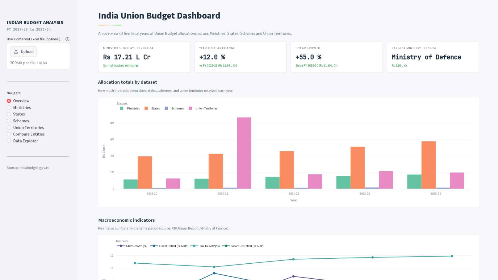
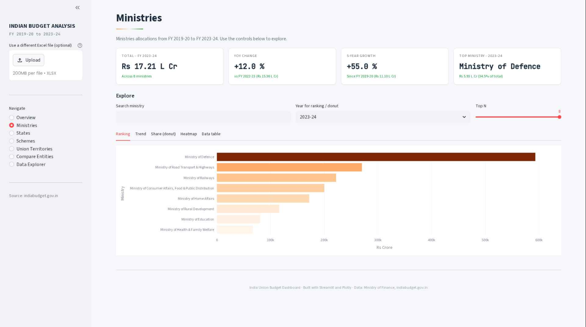
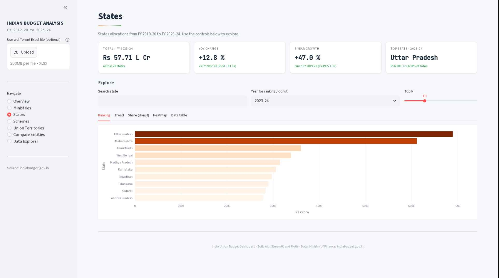
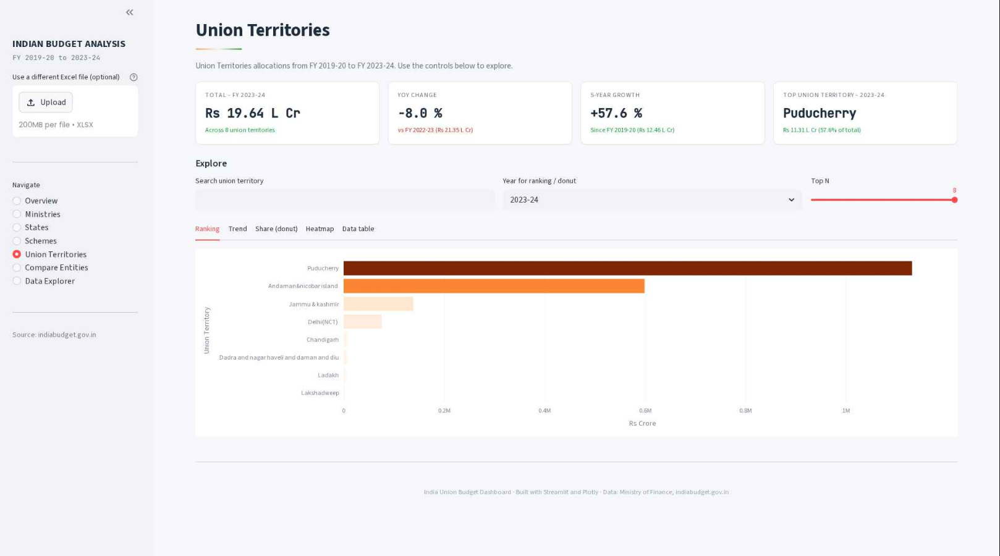
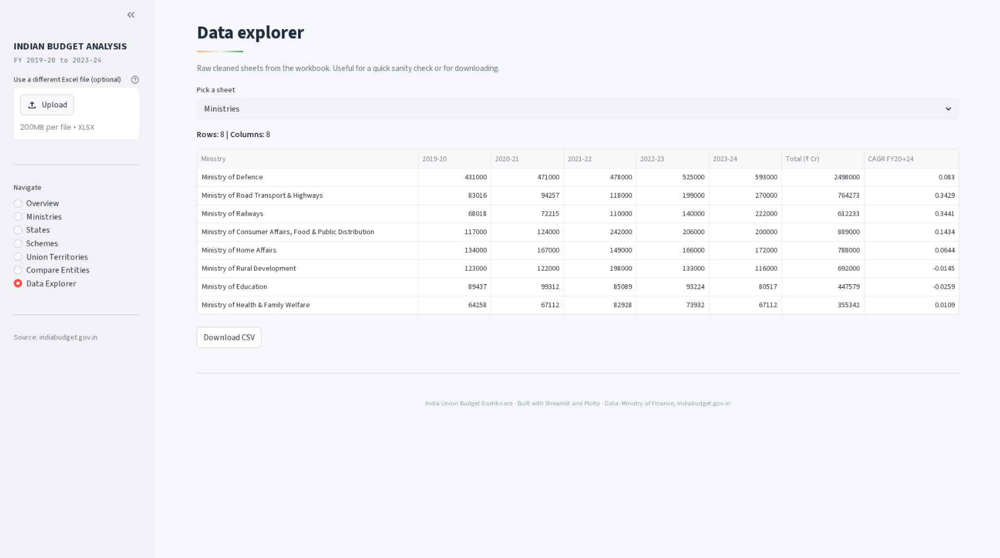

# India Union Budget Analysis Dashboard
India Union Budget Analysis Dashboard — Interactive Fiscal Data Explorer (FY 2019–2024).

---

## 📌 Overview
This project presents an interactive, multi-page data analytics dashboard built to explore and visualise five years of India's Union Budget allocations — spanning ministries, states, flagship schemes, and union territories.

Powered by Streamlit and Plotly, the dashboard ingests structured Excel data published by the Ministry of Finance and transforms it into an intuitive interface for tracking how public funds have been distributed, how spending priorities have shifted year over year, and how macroeconomic indicators relate to budgetary decisions — all without needing spreadsheet expertise.

---

## 🚀 Key Features

### 📊 National Overview
Displays top-level KPIs — total outlay, year-on-year change, 5-year growth — alongside cross-dataset allocation trends and macroeconomic indicators like GDP growth, fiscal deficit, and inflation.

### 🏛️ Ministry-wise Analysis
Explore allocation rankings, multi-year trends, budget share breakdowns, and intensity heatmaps for every tracked ministry from FY 2019-20 to FY 2023-24.

### 🗺️ State-wise Devolution
Visualise how central funds are distributed across Indian states, with searchable rankings, trend lines, and donut charts for any selected fiscal year.

### 📋 Flagship Scheme Tracking
Analyse budget allocations for government schemes — identify which schemes have grown, stagnated, or been restructured across five fiscal years.

### 🏙️ Union Territory Allocations
Dedicated explorer for UT-specific budgetary data with the same full visualisation suite as other sections.

### ⚖️ Entity Comparison Tool
Pick any two entities from any dataset — a ministry vs. a state, or two schemes — and compare their five-year allocation trajectory side by side with grouped bar charts and KPI cards.

### 🔍 Data Explorer
Browse the raw cleaned data from every sheet directly in the app and download any of them as a CSV with a single click.

### 📈 Rich Visualisation Suite
Every section includes ranking charts, multi-entity trend lines, donut charts with configurable top-N, row-normalised heatmaps, and filterable data tables — all interactive and export-ready.

### 📁 Flexible Data Loading
Supports multiple data sources per sheet — upload a replacement Excel file via the sidebar, fall back to a local path, or use the bundled master workbook automatically.

---

## 🖼️ Project Preview

### 🖥️ Dashboard UI







---

## 🏗️ System Architecture

```
Excel Workbook → Data Ingestion → Cleaning & Normalisation → Streamlit App → Plotly Charts → Interactive Dashboard
```

---

## 🧩 Technologies Used

**Frontend / UI:**
- Streamlit
- HTML + CSS (custom styling via `st.markdown`)

**Visualisation:**
- Plotly Express
- Plotly Graph Objects

**Data Processing:**
- Python 3.10+
- Pandas
- NumPy

**File Handling:**
- OpenPyXL (Excel ingestion)

**Data Source:**
- Microsoft Excel (.xlsx) — Ministry of Finance, Government of India

---

## 📂 Project Structure

```
india-budget-dashboard/
│
├── app.py                               ← Main Streamlit application
├── Indian_Budget_Analysis_Master.xlsx   ← Master workbook (5 sheets)
├── requirements.txt
└── README.md
```

**Workbook sheet structure:**
- Sheet 1 · Ministries — Ministry-wise budget allocations
- Sheet 2 · States — State-wise central fund devolution
- Sheet 3 · Schemes — Flagship scheme budgets
- Sheet 4 · Union Territories — UT-wise allocations
- Sheet 5 · Macroeconomics — GDP growth, fiscal deficit, inflation

---

## ⚙️ Getting Started

**1. Clone the repository**
```bash
git clone https://github.com/Subham-022/Indian-Budget-Analysis.git
cd Indian-Budget-Analysis
```

**2. Install dependencies**
```bash
pip install -r requirements.txt
```

**3. Run the app**
```bash
streamlit run app.py
```

---

## 🎯 Applications

- Public policy research and analysis
- Journalism and budget reporting
- Academic study of Indian fiscal policy
- Government spending transparency initiatives
- Data analytics portfolio projects

---

## 📊 Data Sources

- [Union Budget Documents — indiabudget.gov.in](https://www.indiabudget.gov.in)
- [RBI Annual Report](https://www.rbi.org.in)
- Ministry of Finance, Government of India

> All monetary values are in **Rupees  Lack Crore (₹ Lack Cr)**.

---

## About
India Union Budget Analysis Dashboard — an interactive fiscal data explorer covering FY 2019-20 to FY 2023-24, built with Streamlit and Plotly.

## License
[MIT License](LICENSE)
